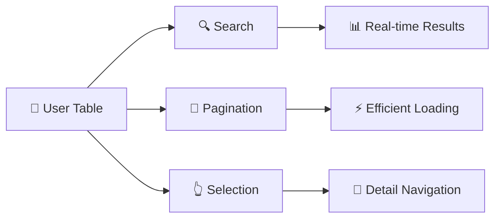
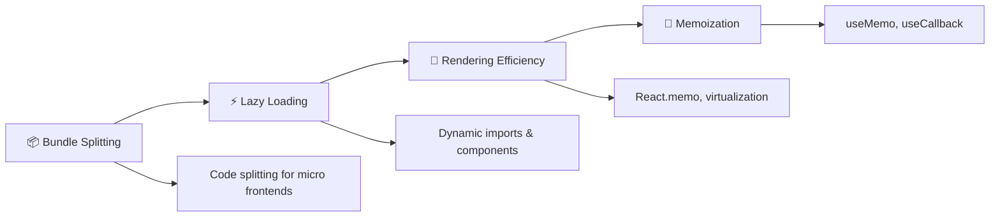

# 🌟 Senior React Developer Take-Home Test
## Micro Frontend Architecture Edition

<div align="center">
  
**A comprehensive evaluation of modern React deve**Key Features**:
- ✅ Form validation with real-time feedback
- ✅ Optimistic UI updates  
- ✅ Loading states and error handling
- ⚪ Basic mobile compatibility (nice to have)
- ✅ Local storage for persistencet skills**

*Micro Frontends • State Management • Performance Optimization • Enterprise Architecture*

</div>

Welcome! This comprehensive take-home test evaluates your expertise in building modern React applications with **micro frontend architecture**, advanced state management, API integration, and contemporary frontend development practices.

---

## 🎯 What You'll Build

<table>
<tr>
<td width="50%">

### 📱 **Dashboard Application**
A React-based micro frontend dashboard featuring:

- 🏗️ **Micro Frontend Architecture**  
  Independent React apps communicating through a shell
  
- 👥 **User Management Interface**  
  User list with search/pagination and detailed user views
  
</td>
<td width="50%">

### ⚛️ **Modern React Showcase**
Demonstrate advanced patterns including:

- 🎣 **Modern React Patterns**  
  Hooks, Context API, custom hooks, performance optimization
  
- 🏢 **Enterprise Architecture**  
  Module Federation or simulated micro frontend integration

</td>
</tr>
</table>

---

## ⏱️ Time Constraint

<div align="center">

### ⏰ **Duration: 4–6 hours (Strictly timeboxed)**

```
🎯 Focus on React patterns and micro frontend concepts
📝 Module Federation simulation is acceptable with clear documentation
⚡ Prioritize architecture decisions and code quality over infrastructure complexity
```

</div>

> **Smart Approach**: Given the time constraint, demonstrate micro frontend **concepts** and **patterns** rather than spending hours on complex build configurations. Full Module Federation setup can be simulated and documented.

---

## 📋 Detailed Requirements

<details>
<summary><h3>🏠 1. Dashboard Shell (Main Container)</h3></summary>

> **Primary Function**: Acts as the main container that dynamically loads and manages micro frontends.

#### 🏗️ Architecture Requirements

| Component | Description |
|-----------|-------------|
| **🔗 Module Federation** | Use any Module Federation implementation or create a clear simulation |
| **⚡ Dynamic Loading** | Load micro frontends independently |
| **📡 Communication Strategy** | Implement one clear inter-micro frontend communication method |
| **🛣️ Routing** | Handle navigation between micro frontends |

</details>

<details>
<summary><h3>📊 2. User List Micro Frontend</h3></summary>

> **Primary Function**: Independent React application for displaying and managing user lists.

#### 🎛️ Components & Features



- **📊 User Table**: Paginated table displaying user information
- **🔍 Search Functionality**: Real-time search across user data
- **📄 Pagination**: Efficient pagination for large datasets
- **👆 Selection**: Allow user selection for detail view

#### 📋 User Interface Requirements

<details>
<summary><strong>🔧 TypeScript Interface Definition</strong></summary>

```typescript
interface User {
  id: number;                    // 🆔 Unique identifier
  name: string;                  // 👤 Full name
  username: string;              // 🏷️ Username
  email: string;                 // 📧 Email address
  address: {
    street: string;              // 🏠 Street address
    suite: string;               // 🏢 Suite/Apartment
    city: string;                // 🏙️ City
    zipcode: string;             // 📮 Postal code
    geo: {
      lat: string;               // 📍 Latitude
      lng: string;               // 📍 Longitude
    };
  };
  phone: string;                 // 📞 Phone number
  website: string;               // 🌐 Website URL
  company: {
    name: string;                // 🏢 Company name
    catchPhrase: string;         // 💭 Company slogan
    bs: string;                  // 📈 Business description
  };
}
```

</details>

</details>

<details>
<summary><h3>👤 3. User Details Micro Frontend</h3></summary>

> **Primary Function**: Independent React application for viewing and editing user details.

#### 🛠️ Components & Features

<table>
<tr>
<td width="50%">

**📋 Core Components**
- 👁️ **User Profile View**: Display comprehensive user information
- ✏️ **Edit Mode**: Allow inline editing of user details
- ✅ **Form Validation**: Real-time validation with error handling
- 💾 **Local Persistence**: Save edits to localStorage

</td>
<td width="50%">

**🎯 Key Features**
- ✅ Form validation with real-time feedback
- ✅ Optimistic UI updates  
- ✅ Loading states and error handling
- ⚪ Basic mobile compatibility (nice to have)
- ✅ Local storage for persistence

</td>
</tr>
</table>

</details>

<details>
<summary><h3>🏗️ 4. Micro Frontend Architecture & Communication</h3></summary>

#### 🎯 Architecture Requirements

<div align="center">

```
🏠 Shell App ←→ 📊 User List MF ←→ 👤 User Details MF
      ↓              ↓                    ↓
   🌐 Router    📡 Communication    💾 Persistence
```

</div>

| Requirement | Implementation Options | Time-Friendly Approach |
|-------------|----------------------|------------------------|
| **🔗 Independent Applications** | Separate React apps OR simulated separation | ✅ **Monorepo with clear boundaries** |
| **⚡ Module Federation** | Full implementation OR **documented simulation** | ✅ **Simulation + architecture docs** |
| **🎯 Clear Boundaries** | Explicit APIs between components | ✅ **Component-level separation** |
| **📡 Communication Strategy** | Choose **ONE**: Context/State, Custom Events, Service | ✅ **React Context (fastest to implement)** |

#### 🗃️ State Management Strategy

<table>
<tr>
<td width="33%">

**🏠 Shell-level State**
- Selected user tracking
- Navigation state
- Global UI state

</td>
<td width="33%">

**🔧 Micro Frontend State** 
- Component-level state
- Form state management
- Local UI interactions

</td>
<td width="33%">

**🌐 Data Layer**
- JSONPlaceholder API
- localStorage persistence
- Error state management

</td>
</tr>
</table>

#### 🔌 API Integration

- 🌐 **RESTful API**: Integration with JSONPlaceholder
- ⚠️ **Error Handling**: Network failures and user feedback
- ⏳ **Loading States**: Proper UX during data operations  
- 💾 **Local Persistence**: localStorage for edit persistence

#### 💡 **Performance Optimization Examples**

<details>
<summary><strong>🚀 Code Optimization Techniques</strong></summary>

```typescript
// 1. Memoized Components
const UserListItem = React.memo(({ user, onSelect }) => {
  return <div onClick={() => onSelect(user)}>{user.name}</div>;
});

// 2. Optimized Search with Debouncing
const useDebounce = (value: string, delay: number) => {
  const [debouncedValue, setDebouncedValue] = useState(value);
  
  useEffect(() => {
    const handler = setTimeout(() => setDebouncedValue(value), delay);
    return () => clearTimeout(handler);
  }, [value, delay]);
  
  return debouncedValue;
};

// 3. Virtualized Lists (for large datasets)
import { FixedSizeList as List } from 'react-window';

// 4. Code Splitting
const UserDetails = lazy(() => import('./UserDetails'));
```

</details>

</details>

---

## 🎨 UI/UX Requirements

<div align="center">

### 🎯 **Design Excellence Standards**

</div>

<table>
<tr>
<td width="33%">

#### 🎨 **Design System** *(Required)*
- ✅ **Open-source Library**  
  Material-UI, Chakra UI, Mantine, **Ant Design (AntD)**
- ✅ **SCSS Integration**  
  Theming and customization overrides
- ✅ **Consistent Theming**  
  Unified theme across micro frontends
- ✅ **Component Customization**  
  Demonstrate system flexibility

</td>
<td width="33%">

#### 📱 **Responsive Design** *(Nice to Have)*
- ⚪ **Basic Mobile Support**  
  Basic functionality on mobile and desktop
- ⚪ **Adaptive Layouts**  
  Tables/forms work reasonably on different screens
- ⚪ **Touch-Friendly Interface**  
  Basic mobile interactions function

</td>
<td width="33%">

#### 👥 **User Experience**
- ✅ **Intuitive Navigation**  
  Clear micro frontend transitions
- ✅ **Search Functionality**  
  Real-time search with debouncing
- ✅ **Loading States**  
  Proper indicators and skeletons
- ✅ **Error Handling**  
  User-friendly messages and recovery
- ✅ **Accessibility Standards**  
  ARIA labels, keyboard navigation

</td>
</tr>
</table>

---

## 🛠️ Technical Stack Requirements

<div align="center">

### ⚡ **Technology Foundation**

</div>

#### 🔧 Core Technologies *(Required)*

<table>
<tr>
<td width="50%">

**⚛️ Frontend Core**
```
React 18+     → Functional components & hooks
TypeScript    → Type safety across micro frontends  
SCSS          → Styling and theming customizations
```

</td>
<td width="50%">

**🏗️ Architecture & Build**
```
Module Federation → Any implementation/simulation
Design System    → Material-UI, Chakra, Mantine, Ant Design (AntD)
Build Tool       → Webpack, Vite, or equivalent
```

</td>
</tr>
</table>

#### 🏛️ Micro Frontend Architecture

| Component | Requirement | Description |
|-----------|-------------|-------------|
| 🏠 **Shell Application** | ✅ Required | Main container app orchestrating micro frontends |
| 🔀 **Independent Apps** | ✅ Required | Separate builds for each micro frontend |
| 📡 **Communication Layer** | ✅ Required | Document and implement chosen strategy |
| 📦 **Shared Dependencies** | ✅ Required | Proper dependency management between apps |

#### 🚀 Performance Optimization *(Required - 10 points)*

<div align="center">



</div>

#### 🧪 Testing & Quality Assurance

<table>
<tr>
<td width="50%">

**🎯 Testing Strategy**
- 🔴 **TDD Approach** *(Bonus)*: Tests before implementation
- 🧩 **Unit Tests**: Components, hooks, utilities
- 🔗 **Integration Tests**: Micro frontend workflows

</td>
<td width="50%">

**🔧 Development Tools**
- 🧪 **Testing Framework**: Jest, React Testing Library
- 📏 **Code Quality**: ESLint + Prettier
- 📊 **Coverage Reports**: Meaningful test coverage

</td>
</tr>
</table>

---

## 🤖 AI Tools & Development Approach

**Use Any Tools You Want!**
- Feel free to use **GitHub Copilot, ChatGPT, Claude**, or any AI coding assistants
- We're interested in your micro frontend architecture and React expertise  
- **Document your process**: Include AI tool usage and approach in README

**What We Want to See**:
- How you structure micro frontend applications
- Your approach to inter-app communication and state management
- Module Federation or micro frontend simulation setup
- Performance optimization techniques
- Testing strategy for distributed frontend architecture
- How you leverage AI tools for productivity within time constraints

---

## 🚀 Getting Started

### Prerequisites

Make sure you have these installed:
- **Node.js 18+** (LTS version recommended)
- **npm** or **yarn** or **pnpm**
- **Git**

### Project Setup Options

#### Option 1: Simulated Micro Frontends *(Recommended for 4-6 hours)*
```bash
# Create single React application with micro frontend simulation
npx create-react-app user-dashboard --template typescript
cd user-dashboard

# Create clear folder structure simulating micro frontends
mkdir -p src/micro-frontends/shell
mkdir -p src/micro-frontends/user-list  
mkdir -p src/micro-frontends/user-details
mkdir -p src/shared/types
mkdir -p src/shared/communication
```

#### Option 2: True Module Federation *(If you have extra time)*
```bash
# Create separate applications (adds 2+ hours setup time)
npx create-react-app user-dashboard-shell --template typescript
npx create-react-app user-list-mf --template typescript
npx create-react-app user-details-mf --template typescript

# Configure Module Federation (complex setup)
npm install --save-dev @module-federation/webpack
```

#### Option 3: Nx Monorepo *(Alternative approach)*
```bash
# Use Nx for micro frontend workspace
npx create-nx-workspace user-dashboard --preset=react-monorepo --packageManager=npm
```

### Required Dependencies

```bash
# Design System (choose one)
npm install @mui/material @emotion/react @emotion/styled @mui/icons-material
# OR
npm install @chakra-ui/react @emotion/react @emotion/styled framer-motion
# OR  
npm install @mantine/core @mantine/hooks @mantine/notifications
# OR
npm install antd @ant-design/icons

# SCSS Support
npm install --save-dev sass

# API & Data Fetching
npm install axios

# Testing (if implementing TDD bonus)
npm install --save-dev @testing-library/react @testing-library/jest-dom @testing-library/user-event

# Development Tools
npm install --save-dev eslint prettier
```

### Data Source

**JSONPlaceholder API**: `https://jsonplaceholder.typicode.com/users`
- 10 sample users with complete profile data
- Read-only API (implement localStorage for persistence)

---

## 📊 Scoring Breakdown

| Section | Points | Details | Good (3/5) | Excellent (5/5) |
|---------|---------|---------|------------|-----------------|
| **Functional Implementation** | 30 | Core features work | Basic functionality works | Polished UX with error handling |
| **Architecture & Code Quality** | 25 | Clean, documented code | Well-organized components | Reusable, scalable architecture |
| **Micro Frontend Concepts** | 20 | Component separation | Clear folder boundaries | Documented scaling strategy |
| **Design System & SCSS** | 15 | Design system integration | Basic theming applied | Custom theme with SCSS overrides |
| **Performance Optimization** | 15 | Code efficiency | Basic React.memo usage | Advanced optimization + documentation |
| **Documentation** | 5 | README with setup | Basic architecture notes | Comprehensive scaling strategy |
| **Responsiveness & UX** | 5 | Multi-device support | Basic mobile compatibility | Good UX across devices |
| **Bonus: TDD & Tests** | 5 | Test coverage | Some unit tests | TDD approach with integration tests |
| **Total** | **120** | *Bonus points for exceptional implementation* | **72-96 points** | **108-120 points** |

### **🎯 Evaluation Criteria**

<details>
<summary><strong>📈 What Makes an Excellent Implementation (90+ points)</strong></summary>

**⚛️ React Expertise:**
- Modern hooks with proper dependency arrays
- Strategic use of useMemo/useCallback for performance
- Clean component composition and reusability
- Proper TypeScript integration throughout

**🏗️ Architecture Excellence:**
- Clear separation of concerns between "micro frontends"
- Well-defined communication patterns
- Scalable folder structure with logical organization
- Comprehensive documentation of architectural decisions

**🎨 Design & UX:**
- Consistent design system implementation
- Basic mobile compatibility (nice to have, not required)
- Thoughtful loading states and error handling
- SCSS customization demonstrating theming capabilities

**📚 Documentation Quality:**
- Clear setup instructions and architectural overview
- Explanation of micro frontend simulation approach
- Detailed scaling strategy for true Module Federation
- Time trade-offs and next steps clearly documented

</details>

<details>
<summary><strong>⚠️ Common Pitfalls to Avoid</strong></summary>

**🚫 Architecture Issues:**
- Tightly coupled components that don't simulate micro frontend boundaries
- Mixing micro frontend concerns in single components
- No clear communication strategy between components
- Poor folder organization that doesn't reflect architectural intent

**🚫 React Anti-patterns:**
- Unnecessary re-renders due to missing memoization
- Improper hook usage or missing dependency arrays
- Inline object/function creation in render methods
- Not leveraging TypeScript for type safety

**🚫 Time Management:**
- Spending too much time on complex build configurations
- Over-engineering features instead of focusing on core requirements
- Not prioritizing documentation and architectural explanation
- Trying to implement full Module Federation instead of simulation

</details>

## 📝 Deliverables

### Required

1. **GitHub Repository** or **ZIP file** with complete source code

2. **README.md** that includes:
   - **Architecture Description**: How you simulated micro frontend concepts
   - **Scaling Strategy**: How this would evolve into true Module Federation
   - **Communication Strategy**: How components communicate (Context/props/events)
   - **Setup Instructions**: How to run locally  
   - **Time Trade-offs**: What you prioritized and why
   - **Next Steps**: How to implement true micro frontends with more time
   - **Performance Considerations**: Optimization techniques you would implement

### Optional

3. **Live Demo** deployed on Vercel, Netlify, or similar platform
4. **Test Coverage Report** (if implementing TDD bonus)

### **📋 README Template Structure**

Your README should include these sections:

```markdown
# User Dashboard - Micro Frontend Architecture

## 🏗️ Architecture Overview
- Brief description of micro frontend simulation approach
- Folder structure explanation
- Communication strategy chosen and why

## 🚀 Setup Instructions  
- Installation steps
- How to run locally
- Available scripts

## 📡 Micro Frontend Communication
- How components communicate (Context/Events/etc.)
- Data flow between user list and user details
- State management approach

## ⚡ Performance Optimizations
- Specific techniques implemented
- Bundle size considerations
- Rendering optimizations

## 🔄 Scaling to Production
- How this would evolve into true Module Federation
- Build pipeline considerations  
- Deployment strategy for multiple micro frontends

## ⏱️ Time Trade-offs Made
- What you prioritized and why
- What you would implement with more time
- Alternative approaches considered
```

---

## 🧪 Testing Your Implementation

**Core User Flows to Demonstrate**:

1. **User List Loading**: Display users from JSONPlaceholder with pagination
2. **Search Functionality**: Real-time search across user data
3. **User Selection**: Click user in list to view details in second micro frontend  
4. **User Editing**: Edit user details with form validation
5. **Local Persistence**: Edited data persists on page refresh
6. **Basic Mobile Support**: Core functionality works on mobile devices (nice to have)
7. **Error Handling**: Network failures and validation errors handled gracefully

---

## 🎁 Bonus Features (Optional)

- **TDD Implementation**: Show tests written before core features (5 points)
- **Local Persistence**: User edits persist via localStorage
- **Advanced Performance**: Virtual scrolling for large lists
- **Animation**: Smooth micro frontend transitions
- **Accessibility**: Full WCAG compliance with screen reader support
- **Error Boundaries**: Robust error handling between micro frontends

---

## ⏱️ Time Management (Strictly Enforced: 4-6 Hours)

### Suggested Time Allocation *(Optimized for 4-6 hours)*

1. **Setup & Architecture** (45-60 minutes): Single app setup with micro frontend folder structure
2. **Core Implementation** (2-2.5 hours): User list and details components as separate "micro frontends"
3. **Communication & Integration** (45-60 minutes): Shell routing and component communication
4. **Design System Integration** (45 minutes): Design system setup and basic styling
5. **Performance & Documentation** (45-60 minutes): Optimization techniques and comprehensive README

### **🎯 Time-Saving Strategies**

| Instead of... | Do this... | Time Saved |
|---------------|------------|------------|
| **Full Module Federation setup** | **Simulated micro frontends with clear boundaries** | 2-3 hours |
| **Multiple React apps** | **Single app with micro frontend architecture** | 1-2 hours |
| **Complex build configurations** | **CRA with organized folder structure** | 1-2 hours |
| **Advanced performance optimizations** | **Document optimization strategies** | 30-60 minutes |

### Priority Order *(Focus on these first - 4-6 hour edition)*

1. **🏗️ Simulated Architecture** (60 min): Clear folder structure representing micro frontends
2. **⚛️ Core React Components** (2 hours): User list and details with proper separation  
3. **📡 Component Communication** (45 min): Context/props for data sharing between "micro frontends"
4. **🎨 Design System Setup** (45 min): Design system integration and basic styling
5. **📝 Architecture Documentation** (45 min): Document how this would scale to true micro frontends

### **🚀 Success Criteria (Achievable in 4-6 hours)**

✅ **Demonstrate Concepts**: Show understanding of micro frontend principles  
✅ **Clean Architecture**: Well-organized, maintainable code structure  
✅ **React Expertise**: Modern patterns, hooks, performance considerations  
✅ **Documentation**: Clear explanation of architectural decisions  
❌ **Don't Spend Time On**: Complex build configurations, actual Module Federation setup

### **📝 Implementation Examples**

<details>
<summary><strong>🏗️ Folder Structure Example</strong></summary>

```
src/
├── micro-frontends/
│   ├── shell/
│   │   ├── Shell.tsx              # Main container component
│   │   ├── Router.tsx             # Navigation between micro frontends
│   │   └── Communication.tsx      # Shared state/context
│   ├── user-list/
│   │   ├── UserList.tsx           # Main user list component
│   │   ├── UserTable.tsx          # Table with pagination
│   │   ├── SearchBar.tsx          # Search functionality
│   │   └── hooks/useUsers.ts      # Data fetching logic
│   └── user-details/
│       ├── UserDetails.tsx        # Main user details component
│       ├── UserForm.tsx           # Edit form component
│       └── hooks/useUserEdit.ts   # Edit logic & persistence
├── shared/
│   ├── types/User.ts              # Shared TypeScript interfaces
│   ├── api/userService.ts         # API integration layer
│   └── communication/
│       └── UserContext.tsx        # Cross-component communication
```

</details>

<details>
<summary><strong>📡 Communication Pattern Example</strong></summary>

```typescript
// Shared Context for micro frontend communication
const UserContext = createContext<{
  selectedUser: User | null;
  setSelectedUser: (user: User) => void;
}>({});

// In UserList micro frontend
const handleUserSelect = (user: User) => {
  setSelectedUser(user);
  // Navigate to details view
};

// In UserDetails micro frontend  
const { selectedUser } = useContext(UserContext);
```

</details>

---

## 📋 Important Notes

- **Public Packages Only**: Use only open-source, publicly available packages
- **Document Assumptions**: Clearly state any assumptions made due to time constraints
- **Quality over Quantity**: Focus on clean, well-architected code over feature completeness  
- **Next Steps**: In README, document what you would implement with additional time

---

## ❓ Need Clarification?

This test intentionally leaves some architectural decisions open to evaluate your approach to:

- Micro frontend communication strategies
- Performance optimization techniques  
- Design system integration approaches
- Time management and prioritization skills

**Make reasonable assumptions and document them clearly in your README.**

---

**Good luck! We're excited to see your micro frontend architecture skills, React expertise, and problem-solving approach within the time constraints! ⚛️🏗️🚀**
